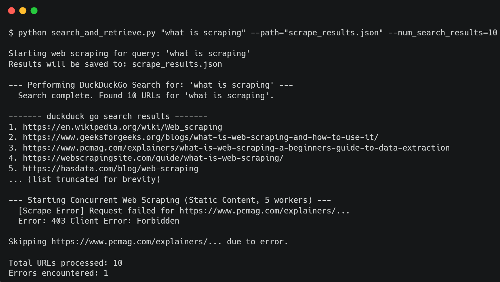

# Concurrent Web Scraper & Search CLI

A powerful, multi-threaded command-line tool written in Python that searches the web (using DuckDuckGo, Google, or Bing) and scrapes the resulting pages for textual content and links.

It features a hybrid fetching mechanism that attempts fast scraping using standard HTTP requests first, and falls back to a headless browser (Playwright) to handle JavaScript-heavy sites or bot protections.

## 🚀 Features

*   **Multi-Engine Support:** Search using DuckDuckGo (default), Google, or Bing.
*   **Concurrent Scraping:** Uses `ThreadPoolExecutor` to scrape multiple URLs simultaneously for maximum speed.
*   **Hybrid Fetching Strategy:**
    *   **Quick:** Uses `requests` for static sites.
    *   **Robust:** Falls back to `Playwright` (headless Chromium) to handle JavaScript, lazy loading, and bot detection mechanisms.
*   **Data Extraction:** Extracts page titles, paragraphs, and links.
*   **JSON Output:** Saves results to a structured JSON file.
*   **Error Handling:** Robust error management for timeouts, network issues, and missing API keys.

## Installation

1. Clone the repository:
   ```bash
   git clone https://github.com/sam-ezz/parallel-web-scraper.git
   ```
2.  Navigate into the project directory:
    ```bash
    cd parallel-web-scraper
    ```
3. Install dependencies:
   ```bash
   pip install -r requirements.txt
   ```
4. Install Playwright Browsers:
   This tool requires the Chromium browser for the headless scraping mode.
   ```bash
   playwright install chromium
   ```


## 💻 Usage

Run the script from the command line using `main.py`.

### Basic Search (DuckDuckGo)
Search for a topic and print results to the console.
```bash
python main.py "Machine Learning"
```
### Save Results to JSON
Search and save the scraped data to a file.
```bash
python main.py "Python programming" --path data.json
```

### Change Search Engine
Use Google or Bing (requires API keys).
```bash
python main.py "Latest tech news" --engine google --num_search_results 10
```

### Fast Mode (Skip Browser Fallback)
Use `--quick` to only use `requests`. This is faster but will fail on JavaScript-heavy websites.
```bash
python main.py "Wiki content" --quick
```

### Arguments Reference

| Argument | Type | Default | Description |
| :--- | :--- | :--- | :--- |
| `query` | string | (Required) | The query to search and scrape. |
| `--path` | string | `None` | File path to store JSON output (e.g., `output.json`). |
| `--num_search_results` | int | `5` | Number of URLs to scrape from search results. |
| `--engine` | string | `duckduckgo` | Search engine: `duckduckgo`, `google`, or `bing`. |
| `--quick` | flag | `False` | If set, scrapes only using standard requests. Reduces errors from browser timeouts but captures less data from dynamic sites. |

## 📄 Output Format

The JSON output (if `--path` is provided) or console output will look like this:

```json
{
    "query": "search term",
    "urls": ["https://example.com", "https://site2.com"],
    "results": [
        {
            "url": "https://example.com",
            "title": "Example Page Title",
            "paragraphs": [
                "Paragraph text content...",
                "More text..."
            ],
            "links": [
                "https://example.com/subpage",
                "https://external.com"
            ]
        }
    ],
    "errors": []
}
```

## Demo

Here is the tool in action searching for "what is scraping":


 
## Disclaimer
This tool is for educational purposes only. Please respect the `robots.txt` of websites and do not use this tool for spamming or overloading servers.
```